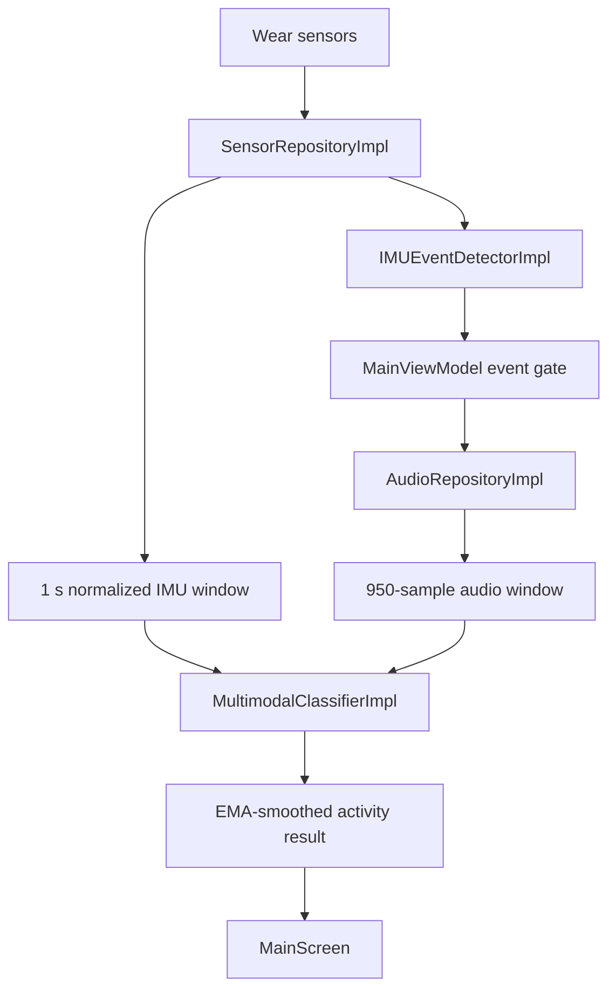

# Architecture

WatchHAR Wear OS is organized around a small domain boundary: repositories
collect live signals, model adapters run TFLite inference, and the ViewModel
coordinates event-gated classification for the Wear UI.

## Components

`MainActivity` owns the Wear entry point, splash setup, and microphone permission
gate. `PermissionRequestScreen` requests microphone access before the main
inference UI starts.

`MainViewModel` starts sensor monitoring, toggles microphone capture according
to the effective event state, invokes the classifier when audio windows are
ready, and smooths probability outputs with an exponential moving average.

`SensorRepositoryImpl` keeps accelerometer and gyroscope callbacks lightweight,
publishes the latest sensor values to a ticker thread, and resamples to a fixed
50 Hz representation. A separate inference thread runs the IMU event detector so
slow inference does not block the sampling cadence.

`AudioRepositoryImpl` creates an `AudioRecord` from available microphone sources,
captures 16 kHz PCM, downsamples to 1 kHz, and emits ready signals after the
rolling audio buffer is warm.

`IMUEventDetectorImpl` wraps `imu_event_detector.tflite` and returns an event
probability for the rolling IMU detector window.

`MultimodalClassifierImpl` loads four TFLite models: IMU encoder, mel
preprocessor, audio encoder, and feature fusion. It infers the fusion output
class count from the loaded model so 27-class, 19-class, and 20-class heads can
share the same runtime path.

## Runtime Shapes

- Event detector input: `150 * 6` IMU floats.
- Stage 2 IMU input: `50 * 6` normalized IMU floats.
- Audio input: `950` PCM samples after downsampling.
- Mel output: `96 * 64` floats.
- IMU encoder output: `128` floats.
- Audio encoder output: `640` floats.
- Fusion output: model-defined class count.

## Implementation Notes

The app intentionally keeps hot-path buffers primitive (`FloatArray`,
`ShortArray`, and direct `ByteBuffer`) to reduce allocations during live capture
and inference. Microphone capture is event-gated to avoid continuously reading
audio while the watch is idle.
